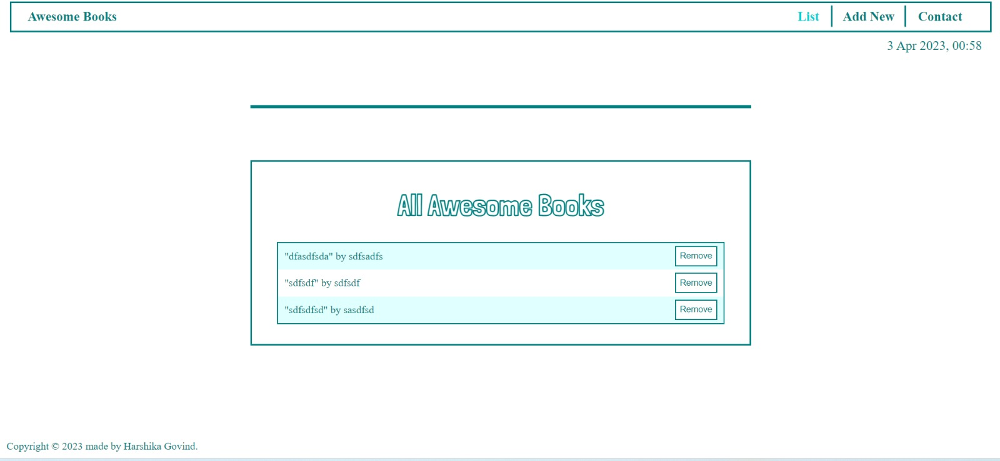
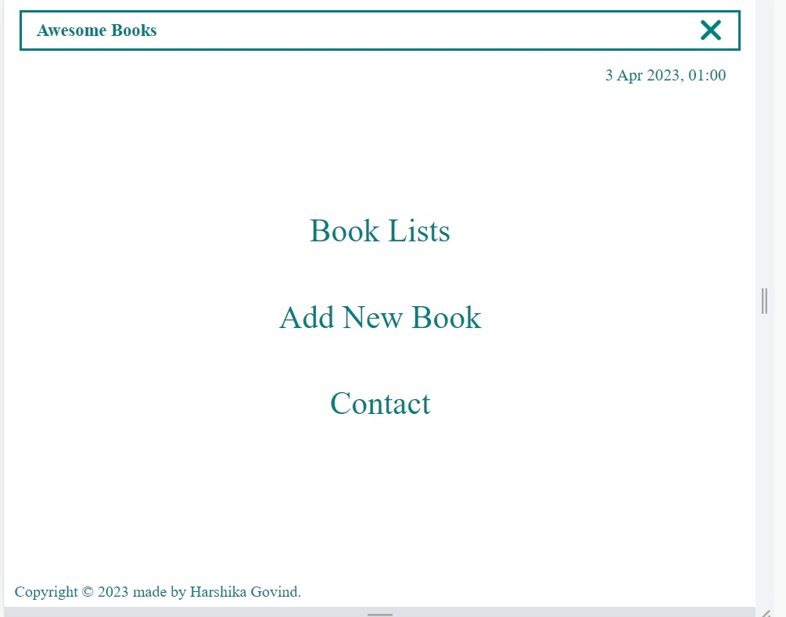

<a name="readme-top"></a>

<!-- TABLE OF CONTENTS -->

# 📗 Table of Contents

- [📖 About the Project](#about-project)
  - [🛠 Built With](#built-with)
    - [Tech Stack](#tech-stack)
    - [Key Features](#key-features)
  - [🚀 Live Demo](#live-demo)
- [💻 Getting Started](#getting-started)
  - [Setup](#setup)
  - [Prerequisites](#prerequisites)
  - [Install](#install)
  - [Usage](#usage)
  - [Run tests](#run-tests)
  - [Deployment](#triangular_flag_on_post-deployment)
- [👥 Authors](#authors)
- [🤝 Contributing](#contributing)
- [⭐️ Show your support](#support)
- [🙏 Acknowledgements](#acknowledgements)
- [📝 License](#license)

<!-- PROJECT DESCRIPTION -->

# 📖 Awesome Books ES6 Project <a name="about-project"></a>

<div align="center">
  
  <br/>
  
  <br/>
  
  <h3><b>Awesome Books ES6 Project</b></h3>

</div>


> "Awesome books" is a simple website that displays a list of books and allows you to add and remove books from that list. Mainly built with javascript in Microverse Module 2.

**Awesome Books ES6 Project** is a HTML, CSS and JavaScript based project.
ES6 syntax is used where Modules is divided and imported in index.js file.
Refracting of all functions to arrow functions is made which also displays the current date below the navigation bar for which **Luxon** library is being downloaded and imported as a  module. 

## 🛠 Built With <a name="built-with"></a>
# Built With
- Lighthouse (An open-source, automated tool for improving the quality of web pages. It has audits for performance, accessibility, progressive web apps, SEO and more).
- Webhint (A customizable linting tool that helps you improve your site's accessibility, speed, cross-browser compatibility, and more by checking your code for best practices and common errors).
- Stylelint (A mighty, modern linter that helps you avoid errors and enforce conventions in your styles).
- ESlint (A mighty, modern linter that helps you avoid errors and enforce conventions in JavaScript codes)


### Tech Stack <a name="tech-stack"></a>

> HTML, CSS, JavaScript and Linter Template

<details>
  <summary>Languages</summary>
  <ul>
    <li>HTML</li>
    <li>CSS</li>
    <li>JavaScript</li>
  </ul>
</details>

<!-- Features -->

### Key Features <a name="key-features"></a>

- **Single Page Application**
- **Add Book Feature**
- **Remove Book Feature**
- **Saving current state of book list to local storage**


<p align="right">(<a href="#readme-top">back to top</a>)</p>

<!-- LIVE DEMO -->

## 🚀 Live Demo <a name="live-demo"></a>

- [Live Demo Link](https://harshi0102.github.io/AwesomeBooks-ES6/)

<p align="right">(<a href="#readme-top">back to top</a>)</p>

<!-- GETTING STARTED -->

## 💻 Getting Started <a name="getting-started"></a>


To get a local copy up and running, follow these steps.

### Prerequisites

The basic requirements for building the executable are:

-  A working browser application (Google chrome, Mozilla Fire fox, Microsoft edge ...)
- VSCode or any other equivalent code editor.
- Node Package Manager (For installing packages like Lighthous, webhint & stylelint used for checking for debugging bad codes before deployment).

### Setup

Checkout the project repository <a href="https://github.com/harshi0102/AwesomeBooks-ES6.git">here</a>

### Install

You can use the repository HTTPS or SSH urls to clone the project on your local machine or download the ZIP folder and extract its contents.

## Getting packages and debuging with Stylelint
```
npm install --save-dev stylelint@13.x stylelint-scss@3.x stylelint-config-standard@21.x stylelint-csstree-validator@1.x
```
##### For validation detection using Stylelint Run
```
npx stylelint "**/*.{css,scss}"
```
##### from parent source directory

## Getting packages and debuging with ESlint
```
npm install npm install --save-dev eslint@7.x eslint-config-airbnb-base@14.x eslint-plugin-import@2.x babel-eslint@10.x
```
##### For validation detection using Stylelint Run
```
npx eslint .
```
##### from parent source directory

## Getting packages and debuging with Webhint
```
npm init -y
npm install --save-dev hint@6.x
```
##### For validation detection using Webhint Run
```
npx hint .
```


### Usage

Run the index.html file in the root directory of the project using any browser.

### Run tests

Use Chrome dev tools
Ensure to checkout any linter errors

### Deployment

Use Github pages for free and secure deployment.

<p align="right">(<a href="#readme-top">back to top</a>)</p>


<!-- AUTHORS -->

## 👥 Authors <a name="authors"></a>

>Harshika Govind

👤 **Harshika Govind**

- GitHub: [@githubhandle](https://github.com/harshi0102)
- Twitter: [@twitterhandle](https://twitter.com/harshika0102me)
- LinkedIn: [LinkedIn](https://www.linkedin.com/in/harshikagovind)

<p align="right">(<a href="#readme-top">back to top</a>)</p>

<!-- FUTURE FEATURES -->

## 🔭 Future Features <a name="future-features"></a>

- [ ] **About Page**

<p align="right">(<a href="#readme-top">back to top</a>)</p>

<!-- CONTRIBUTING -->

## 🤝 Contributing <a name="contributing"></a>

Contributions, issues, and feature requests are welcome!

Feel free to check the [issues page](https://github.com/harshi0102/AwesomeBooks-ES6/issues).

<p align="right">(<a href="#readme-top">back to top</a>)</p>

<!-- SUPPORT -->

## ⭐️ Show your support <a name="support"></a>

Give a ⭐️ if you like this project!

<p align="right">(<a href="#readme-top">back to top</a>)</p>

<!-- ACKNOWLEDGEMENTS -->

## 🙏 Acknowledgments <a name="acknowledgements"></a>

I would like to thank Microverse.

<p align="right">(<a href="#readme-top">back to top</a>)</p>

<!-- LICENSE -->

## 📝 License <a name="license"></a>

This project is [MIT](https://github.com/harshi0102/AwesomeBooks-ES6/blob/main/LICENSE) licensed.

<p align="right">(<a href="#readme-top">back to top</a>)</p>
